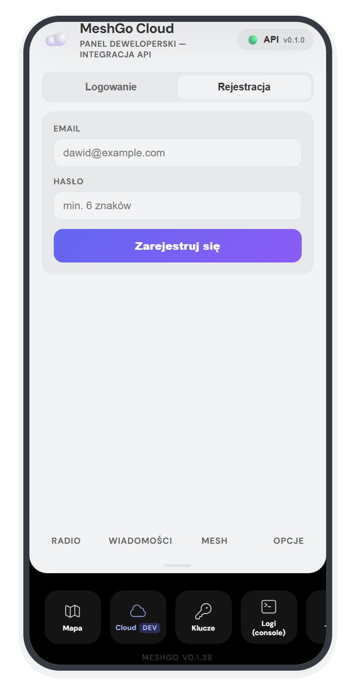
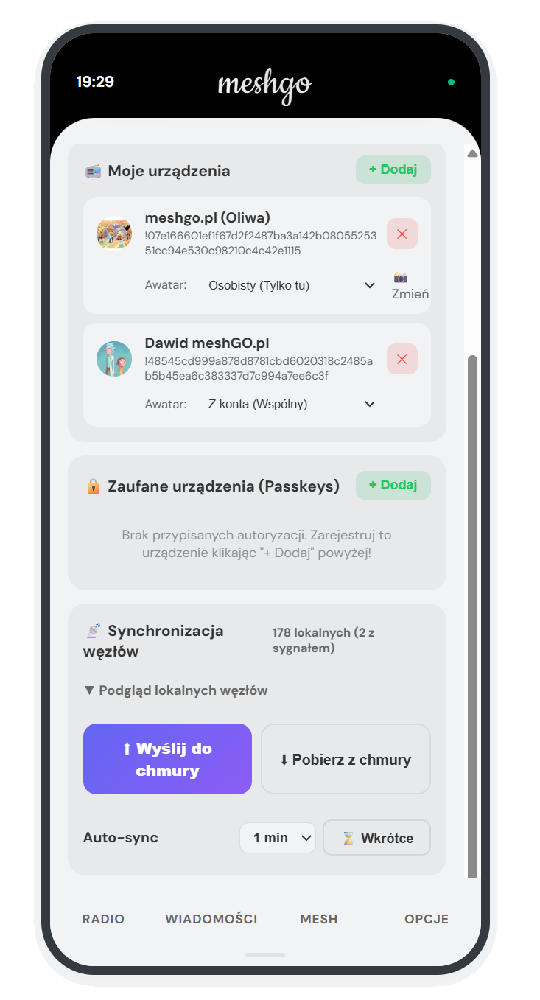
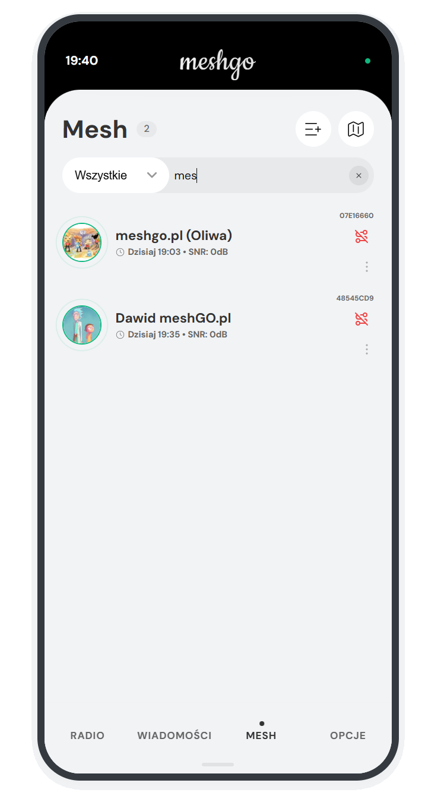

# Instrukcja Testowania Synchronizacji z Chmurą i Awatarów

Ten dokument opisuje szybką ścieżkę testową dla funkcji synchronizacji danych z siecią oraz wgrywania awatarów w aplikacji MeshGo.

---

## 📱 Pobieranie i Instalacja (Android)

Zanim zaczniesz testy, upewnij się, że masz zainstalowaną najnowszą wersję aplikacji:

1. **Pobieranie**: Wejdź na stronę [meshcore.pl/apk](https://meshgo.pl/apk) na swoim telefonie.
2. **Automatyczny Start**: Pobieranie powinno rozpocząć się automatycznie. Jeśli nie, kliknij przycisk "Pobierz bezpośrednio (.apk)".
3. **Instalacja**:
   * Otwórz pobrany plik `.apk`.
   * Jeśli system zapyta o zgodę na instalację z nieznanych źródeł (np. z przeglądarki Chrome), wyraź zgodę.
   * Kliknij "Zainstaluj" (lub "Aktualizuj" jeśli masz starszą wersję).
   * Aplikacja MeshGo jest teraz gotowa do działania!

---

## 🛠️ Procedura Testowa (Cloud DEV)

Wszystkie poniższe kroki należy wykonać w dolnym panelu w sekcji **Cloud DEV** (panel ten wyciąga się gestem **swipe up** od dolnej krawędzi okna aplikacji):

1. **Rejestracja**: Zarejestruj się, używając dowolnego adresu e-mail.
   

2. **Logowanie**: Po utworzeniu konta zaloguj się do panelu.

3. **Dodanie Urządzenia**: Dodaj swoje urządzenie do listy.

4. **Wgranie Awatara**: Przejdź do profilu i wgraj swój awatar profilowy.

5. **Konfiguracja Trybu**:
   * Przy dodanym urządzeniu wybierz opcję: **'Z konta'** (Wspólny). Gwarantuje to, że urządzenie będzie dziedziczyć grafikę z powiązacego konta chmurowego.

6. **Finalizacja**:
   * Na dole ekranu głównego kliknij przycisk **⬇ Pobierz z chmury**.
   * System powinien pobrać dane z synchronizacji i wyświetlić Twój awatar przy węźle.
   

---

## 📡 Synchronizacja listy węzłów (Opcjonalne)

Możesz przetestować wysyłanie do chmury informacji o węzłach ("kontaktach"), które Twoje radio LoRa zdążyło zapisać w swojej pamięci:

1. **Wysyłanie**: W tym samym panelu Cloud DEV wybierz opcję **⬆ Wyślij do chmury**.
2. **Co jest przesyłane?**:
   * System przesyła wyłącznie publiczne identyfikatory urządzeń (Short ID/Klucze publiczne) oraz ich ostatnio zarejestrowaną telemetrię (RSSI, SNR).
   * **Bezpieczeństwo**: Przesyłane są dane o **topologii i strukturze sieci**, które i tak krążą publicznie w eterze i są widoczne dla każdego odbiornika.
   * **Prywatność**: Żadne dane wrażliwe, treści prywatnych wiadomości ani klucze prywatne **nie opuszczają** urządzenia. Synchronizacja służy wyłącznie do budowania wspólnej mapy zasięgu i topologii w chmurze MeshCore.
3. **Weryfikacja**: Wejdź do zakładki **Mesh** w menu i sprawdź, czy są widoczne awatary urządzeń dla kontaktów takich jak np. **meshgo.pl Oliwa**.
   

---

> [!IMPORTANT]
> **Dlaczego to jest ważne?**  
> Ten test weryfikuje pełny przepływ danych: od zapisu binarnego w chmurze, przez system Smart Hash Sync, aż po renderowanie grafiki z lokalnego cache IndexedDB (Offline-First).

